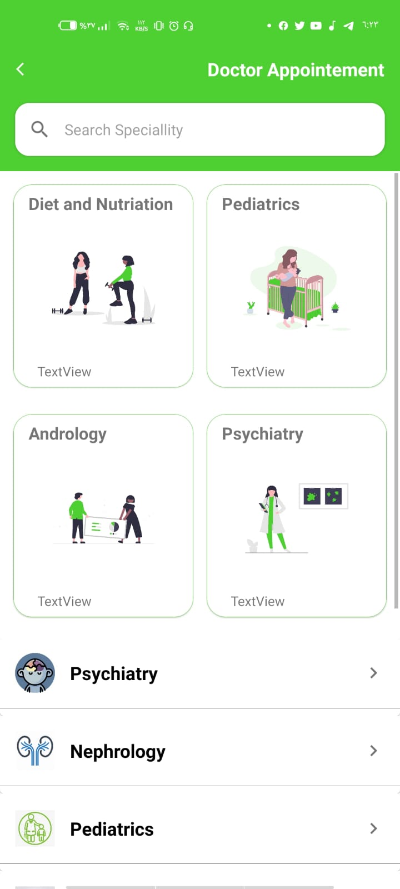

# Se7ty app native android app

Appointment booking application with doctors is the best choice for the user and the doctor who helps the doctor in adding appointments for his spare time for the extra work that helps the user to coordinate his healthy life and he can share with the doctor with his medical record or the medicines he takes and if he wants a position for emergency preparation, the application will notify the user of the dates The application allows the user to book an appointment for the covered test from a specific branch

The system consists of 3 applications 1 - for the user 2 - for the doctor 3 - for the manager to accept or reject the doctor by looking at his certificate, adding branches and managing the application

# se7ty
## features
- Authentication (Log in ,Register,remmember password,log in with google)
- show all doctors avilable
- show all services avilable
- show my up comming dates
- show my cancled booking
- show all doctor avilable in maps
- send emergency massage
- search
- log out
- notification
- and more ........

## Technology i used it
- android native with kotlin
- ui with xml - material design
- for manger app i used jetpack compose for ui
- firebase dataStorage
- firebase firestory
- firebase Auth
- firebase fcm
- Navigation componnent
- live data for easy state
- state flow for complex state with fillter and map data
- flow
- Coroutines for async programming
- coil for load img
- mvvm with repositry pattern
- for manger app with jetpack compose i used mvvm with repositry pattern and clean archicture with use cases 
- dependency injection with hilt
- room for local database
- recycler view
- rotrofit for send notification
- data binding
- data store prepherences
- google maps with coustom style marker
 

##🌴

 
 

 
 

 
 

 
 

 
 

 
 

 
 

 
 

 
 
